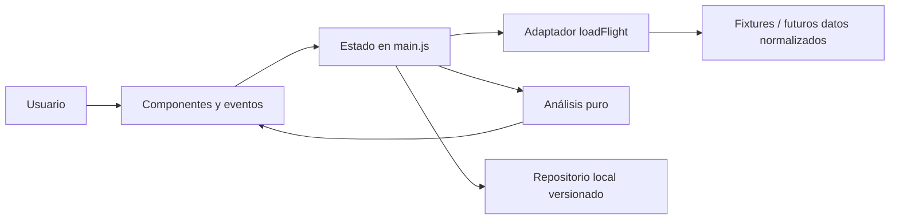

# Arquitectura del MVP

## Decisión

Frontend estático con Vite, módulos ESM, HTML semántico y CSS. Sin framework de UI: el alcance es una sola aplicación de cinco vistas con estado pequeño y componentes puros. Un render de la página responde a cada transición; se conserva/restaura el foco en los controles que la provocan. Esta elección reduce dependencias, pero debe revisarse si el mapa crece a miles de elementos o si se agrega edición compleja.



## Límites de responsabilidad

- `domain/analysis.js`: sin DOM, red o persistencia. Analiza exclusivamente datos normalizados; solo recomienda asientos disponibles.
- `data/demo.js`: simula latencia, error, ausencia y visibilidad parcial. Dos cabinas deterministas y tres snapshots; ningún dato se obtiene en vivo.
- `data/storage.js`: lectura defensiva y resultado explícito de escritura. La UI muestra fallos de almacenamiento. Los datos persistidos se escapan antes de interpolarlos.
- `components/*`: funciones de presentación. `seat-map.js` distingue estado operativo, calidad, pertenencia a grupos y recomendación.
- `main.js`: coordinación, navegaciones hash, selector de cabina, escenario, zoom, selección, tab móvil y diálogos.

Las solicitudes de cambio de cabina/escenario tienen un contador: una respuesta anterior no puede sobrescribir una solicitud más reciente.

## Contrato del adaptador

`loadFlight(cabin, mode) -> Promise<{ seats: Seat[], history: Snapshot[] }>`

```js
// Seat
{
  id: '12A', row: 12, block: 0, position: 0,
  type: 'Ventana', // Ventana | Central | Pasillo
  status: 'premium', // available | occupied | blocked | premium | unknown
  quality: 93, recommended: true,
  price: 35, // EUR en esta demo; null cuando no se conoce
  note: 'Espacio extra junto a salida…'
}
// Snapshot
{ label: '24 sep · 10:42', seats: [] }
```

Los asientos se ordenan por fila, bloque y posición. `block` identifica grupos físicos separados por pasillos. `premium` significa **disponible** con características extra; premium ocupado usa `occupied`. En producción, separar características de estado, añadir moneda, timestamp ISO por snapshot, configuración certificada, fuente, razón de confianza y un identificador estable de avión/cabina.

## Modelo persistido

```js
{
  saved: true, // vuelo único de la demo
  preference: 'Ventana',
  alerts: [{
    id: 'uuid', flightId: 'IB539-2026-10-15', cabin: 'economy',
    type: 'together', // recommended | together | score | signal
    createdAt: 'ISO-8601'
  }]
}
```

No se ejecutan estas reglas. El historial representa fixtures del espacio invitado, no historial remoto del usuario. No hay endpoints, sesión, reserva, precio del billete ni checkout.

## Requisitos y comprobación

| Requisito de la spec             | Implementación / evidencia                                       |
| -------------------------------- | ---------------------------------------------------------------- |
| 6 bloques principales            | Header, hero, KPIs, mapa, panel y snapshots                      |
| Una conclusión principal         | `SIGNALS[buyNowSignal]`, compartido por hero, KPI y acción       |
| 8 métricas                       | `analyze`, documentadas en README y cubiertas por pruebas        |
| 6 estados visuales               | 5 estados operativos + contorno recomendado; texto/símbolos      |
| 5 capas                          | `seatMap`, controles con `aria-pressed`, leyenda dinámica        |
| Calidad espacial                 | Mamparas, alas, baños, galley, salida y notas; plano ilustrativo |
| Dos/tres contiguos               | `groupsOf`, nunca cruza pasillos ni filas                        |
| Historial                        | Tabla y sparklines, tres snapshots por cabina                    |
| Cuatro alertas                   | Diálogo, deduplicación, listado, borrado y persistencia local    |
| Mobile                           | Tabs de secciones, mapa desplazable/ampliable, CTA fijo          |
| Loading / vacío / baja confianza | Selector de escenarios + reintento; también fallo de carga       |
| Watchlist y perfil               | Almacenamiento local validado                                    |

## Riesgos y límites

- La disponibilidad mostrada por una aerolínea no demuestra ventas: los estados bloqueado/desconocido no se cuentan como ocupados.
- La calidad es una ponderación ilustrativa por zona, no un dato certificado de ergonomía.
- Los grupos contiguos se solapan: las cifras de pares no equivalen a parejas independientes.
- La señal de compra se refiere a elección de asiento, no al precio del billete.
- No se infieren rutas ni planos reales de Iberia. La marca textual y el vuelo son contexto de demostración.
- Antes de producción se requiere validar precios, seguridad de datos, aislamiento entre usuarios, resultados de proveedor y accesibilidad con lectores de pantalla.
