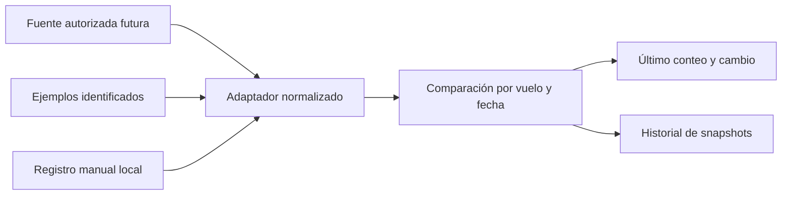

# Arquitectura · seguimiento de plazas Air Europa

## Objetivo

Guardar y mostrar la evolución del **número de plazas libres reportadas** para cada vuelo Air Europa en una fecha. Filtro por ruta y fecha; tarjetas ordenadas por último recuento; detalle con timestamps y una serie diaria. La interfaz no decide por el viajero ni asigna un porcentaje de éxito a partir de una cifra aislada.

## Flujo



`loadFlights()` es el punto de reemplazo. El backend futuro debe consultar una API o acuerdo autorizado y guardar snapshots con timestamp de la fuente; jamás debe inferir plazas libres sumando cupos tarifarios o contando botones verdes en un mapa.

## Modelo

```js
{
  id: 'flight-id', airline: 'Air Europa',
  origin: 'MAD', destination: 'PMI', date: '2026-10-15',
  flightNumber: 'UX123', departure: '12:35', source: 'provider',
  snapshots: [
    { at: '2026-09-24T10:42:00Z', count: 6, source: 'provider' }
  ]
}
```

El piloto actual permite `source: demo | manual`. `provider` debe añadirse solo cuando se implemente la conexión. Se valida cada snapshot; `count = 0` es válido y distinto de `null`/sin observación. El gráfico diario toma la última observación UTC de cada día. Si dos recuentos cambian de 6 a 8, la diferencia es +2; no se deduce ningún motivo.

La identidad de un vuelo debe incluir operador real, número, ruta y fecha; las entradas demo son ficticias. Los registros manuales se aíslan en `localStorage` bajo `vuelalibre:availability-pilot:v1`. Para múltiples usuarios harán falta backend, autenticación y control de acceso.

## Evaluación de conexiones

| Fuente                        | Dato disponible                                              | Decisión                                                         |
| ----------------------------- | ------------------------------------------------------------ | ---------------------------------------------------------------- |
| StaffTraveler                 | Cargas para viajes staff, actualizadas por personas usuarias | Mejor candidato para acuerdo de datos; API pública no encontrada |
| Air Europa Direct NDC         | Ofertas comerciales para agencias                            | No equivale a plazas staff                                       |
| Amadeus Flight Availabilities | Inventario para venta por clase                              | No equivale a plazas libres reales                               |
| OAG Seats                     | Capacidad de asientos instalada/predicha                     | No indica ocupación actual                                       |

Referencias directas en README. Una conexión útil debe cubrir Air Europa por vuelo y fecha, total libre, momento de lectura, cobertura y límites de reutilización. Antes de desplegar actualizaciones automáticas debe aclararse acceso, licencia, coste y frecuencia de consulta. No se ha verificado ninguna de estas condiciones para una integración en producción.

## Cobertura

Pruebas de dominio para ordenación, cambios, recuento cero y consolidación diaria; Playwright para búsqueda sin datos inventados, detalle, registro y actualización persistente, teclado y móvil. CI ejecuta `npm run check`.
